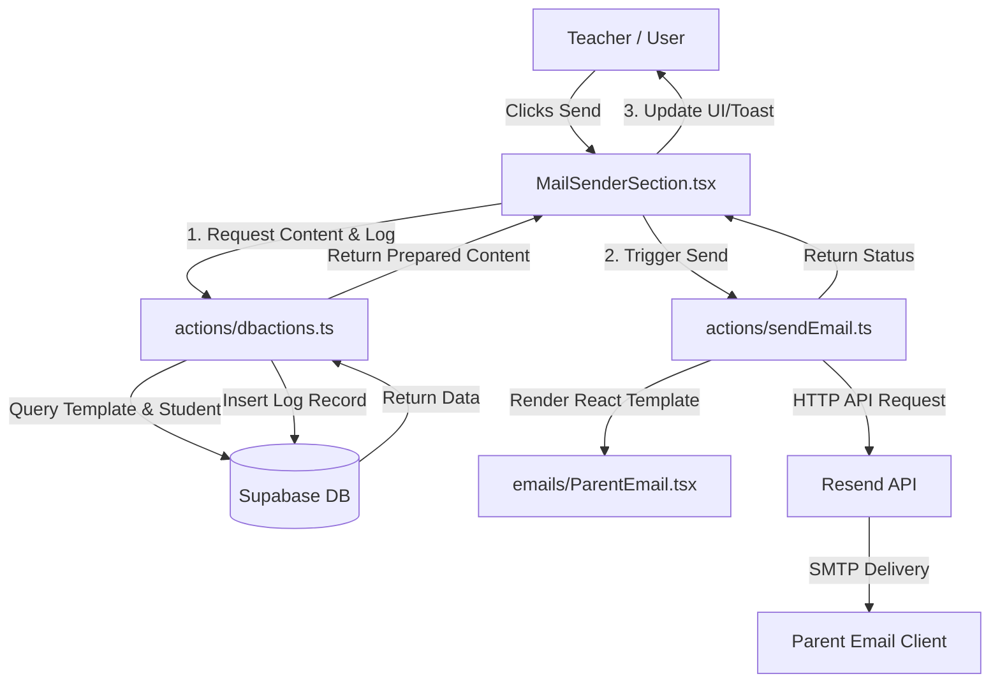

# Email System Technical Documentation

## 1. Executive Summary

The email system within the Teacher Dashboard is designed to facilitate efficient communication between teachers and parents regarding student performance, specifically focusing on attendance violations and task submission statuses.

**Primary Technologies:**
*   **Email Delivery**: **Resend API** (Transactional email service).
*   **Template Engine**: **React Email** (Component-based email design) & Dynamic String Replacement.
*   **Backend Logic**: **Next.js Server Actions** (Server-side execution).
*   **Database**: **Supabase (PostgreSQL)** for logging, templates, and configuration.

**Architectural Pattern:**
The system utilizes a **Synchronous Server-Side Execution** pattern. Unlike asynchronous producer-consumer architectures with persistent message queues (like Redis), this system triggers email transmission directly via Server Actions initiated by user interaction in the frontend. This approach minimizes infrastructure complexity suitable for the current scale, providing immediate feedback to the user.

## 2. System Architecture Overview



**Components:**
1.  **Frontend (Producer)**: `MailSenderSection.tsx` identifies violations and initiates requests.
2.  **Database Action (Logger/preparer)**: `dbactions.ts` prepares the email payload (subject/body) by merging data with templates and logs the entry to the database.
3.  **Email Action (Sender)**: `sendEmail.ts` handles the actual transmission via the Resend SDK.
4.  **External Provider**: **Resend** handles the SMTP delivery infrastructure.

## 3. Detailed Step-by-Step Process

### Step 1: Request Initiation & Payload Construction

*   **Triggering Event**: The teacher clicks "Confirm Send" (for a single violation) or "Confirm Send All" (for bulk processing) in the `MailSenderSection` component.
*   **Payload Construction**:
    *   The system first calls `logEmailToDb` (an alias for `sendEmail` in `dbactions.ts`).
    *   This function fetches the specific student's details and the appropriate `EmailTemplate` based on the `violation_type`.
    *   It constructs the final `subject` and `body` by replacing placeholders (e.g., `{STUDENT_NAME}`) with actual data.
*   **File References**:
    *   `components/MailSenderSection.tsx`: UI Controller and logic for detecting violations.
    *   `actions/dbactions.ts`: Contains the `sendEmail` function responsible for data merging.

### Step 2: Template Rendering

The system uses a two-stage rendering process:
1.  **Text Content Rendering**: Dynamic text replacement happens in the database action layer.
    *   **Logic**: `subject.replace('{STUDENT_NAME}', student.name)`
    *   **File**: `actions/dbactions.ts`
2.  **HTML Structure Rendering**: The prepared text content is wrapped in a responsive HTML email structure using **React Email**.
    *   **Template Engine**: React Email components (`<Html>`, `<Body>`, `<Container>`, `<Tailwind>`).
    *   **Logic**: The `ParentEmail` component receives `subject` and `content` as props and renders them into a styled HTML document.
    *   **File References**:
        *   `emails/ParentEmail.tsx`: The React Email template definition.
        *   `actions/sendEmail.ts`: Uses `React.createElement` to render the component.

### Step 3: Queueing the Email Task

*   **Current Implementation**: The system **does not** use a persistent backend queue (like Redis or SQS).
*   **Mechanism**:
    *   For **Single Emails**: The request is awaited directly.
    *   For **Bulk Emails** (`handleSendAllEmails`): The frontend iterates through the list of violations and awaits each call sequentially (or concurrently depending on implementation).
    *   **Note**: This relies on the client maintaining the connection. If the user closes the tab during a bulk send, processing stops.
*   **File References**:
    *   `components/MailSenderSection.tsx`: Handles the iteration logic in `handleSendAllEmails`.

### Step 4: Email Worker Processing

*   **Context**: Since there is no dedicated worker service (consumer), the "worker" is effectively the Vercel Serverless Function executing the `sendEmailViaResend` Server Action.
*   **Execution**: The Server Action is invoked via an RPC-like call from the client. It initializes the Resend client using the API key.
*   **File References**:
    *   `actions/sendEmail.ts`: Acts as the ephemeral worker.

### Step 5: Transmission via SMTP/API

*   **Protocol**: HTTPS (REST API). The system uses the Resend SDK, which makes an HTTP POST request to Resend's API endpoints. Resend then handles the SMTP handshake with receiving mail servers.
*   **Payload**:
    *   `from`: configured sender (e.g., `Mr.Yeti <onboarding@resend.dev>`).
    *   `to`: `[recipient_email]`.
    *   `subject`: `prepared_subject`.
    *   `react`: The rendered React component tree.
*   **Code Snippet** (`actions/sendEmail.ts`):
    ```typescript
    const resend = new Resend(process.env.RESEND_API_KEY)
    
    export const sendEmailViaResend = async ({ to, subject, content }: SendEmailParams) => {
      const { data, error } = await resend.emails.send({
        from: 'Mr.Yeti <onboarding@resend.dev>',
        to: [to],
        subject: subject,
        react: React.createElement(ParentEmail, {
          subject,
          content,
          previewText: subject
        }),
      })
      // ... error handling
    }
    ```

### Step 6: Response Handling & Error Management

*   **Success**: Returns `{ success: true, data: ... }`. The UI displays a success toast: `toast.success(...)`.
*   **Failure**:
    *   **Resend API Error**: Caught in the `sendEmailViaResend` function. Returns `{ success: false, error: ... }`.
    *   **UI Handling**: The frontend checks `result.success`. If false, it shows `toast.error('Logged to DB but failed to send email via Resend')`.
*   **Retry Logic**: Currently, there is no automatic retry logic implemented in the code. Failed sends must be manually retried by the user.
*   **File References**:
    *   `actions/sendEmail.ts`: Catches API errors.
    *   `components/MailSenderSection.tsx`: Handles user feedback.

### Step 7: Logging & Analytics

*   **Data Logged**:
    *   `student_id`, `recipient_email`, `subject`, `body`, `sent_at`, `violation_type`.
*   **Storage**: Supabase PostgreSQL table `sent_emails`.
*   **Timing**: Logging occurs **before** the API call to Resend in the current flow (`logEmailToDb` is called before `sendEmailViaResend`).
*   **File References**:
    *   `actions/dbactions.ts`: `sendEmail` (logs to DB).
    *   `supabase/migrations/create_school_schema.sql`: Schema definition for `sent_emails`.

## 4. Configuration & Environment Variables

The system relies on the following environment variables. These must be set in the deployment environment (e.g., Vercel) and the local `.env` file.

| Variable Name | Description | Required | Example |
| :--- | :--- | :--- | :--- |
| `RESEND_API_KEY` | API Key for authenticating with Resend service. | Yes | `re_123456789...` |
| `NEXT_PUBLIC_SUPABASE_URL` | URL for the Supabase project instance. | Yes | `https://xyz.supabase.co` |
| `NEXT_PUBLIC_SUPABASE_ANON_KEY` | Public anonymous key for Supabase client. | Yes | `eyJ...` |

**Note**: Do not commit actual keys to version control.

## 5. Security Considerations

*   **API Key Protection**: The `RESEND_API_KEY` is only accessed in `actions/sendEmail.ts`, which includes the `'use server'` directive. This ensures the key is never exposed to the client-side bundle.
*   **Content Injection**: React Email automatically escapes content rendered within its components, mitigating XSS risks in email clients.
*   **Access Control**: Database Row Level Security (RLS) policies (defined in `create_school_schema.sql`) restrict access to the `sent_emails` and `students` tables, ensuring only authenticated users can read/write sensitive data.
*   **Sender Reputation**: Using a verified domain with Resend (DKIM/SPF) is recommended for production to prevent emails from landing in spam folders (currently using `onboarding@resend.dev` for testing).

## 6. Testing Strategy

*   **Unit/Integration Testing**:
    *   **Template Rendering**: Can be tested by rendering `ParentEmail` in isolation and checking the output HTML.
    *   **Payload Construction**: Test `sendEmail` in `dbactions.ts` to verify placeholders are replaced correctly.
*   **Manual Sandbox Testing**:
    *   **Resend Dev Mode**: When using the `onboarding@resend.dev` domain, emails are only delivered to the email address registered with the Resend account, preventing accidental spamming of real users during development.
*   **Failure Scenarios**:
    *   Test by providing an invalid API key to verify error handling in the UI.
    *   Disconnect network to test client-side error states.
